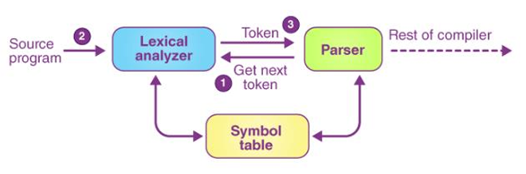
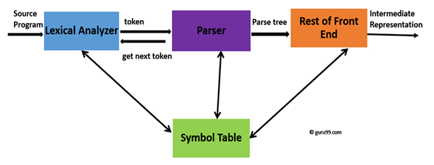
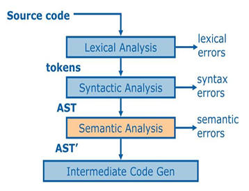

# PieByte Compiler 

The PieByte compiler is written using Python, but it inspires to be a compiler that helps beginner programmers in getting use to programming languages, it by no means is a replacement for any well established programming languages in the world. PieByte translates code written in the PieByte language into an equivalent target language i.e C++.

## Table of Contents

-   [Introduction](#introduction)
-   [Language Description](#language-description)
    -   [Data Types](#data-types)
    -   [Conditionals](#conditionals)
    -   [Loops](#loops)
    -   [Functions](#functions)
    -   [Keywords](#keywords)
-   [Compiler Phases](#compiler-phases)
    -   [Lexical Analyzer](#lexical-analyzer)
    -   [Syntax Analyzer](#syntax-analyzer)
    -   [Semantic Analyzer](#semantic-analyzer)
        -   [Functions of Semantic Analysis](#functions-of-semantic-analysis)
-   [Getting Started](#getting-started)

## Introduction

The PieByte compiler aims to simplify the learning curve for new programmers. It achieves this by using a straightforward syntax with simple English keywords, making it easier to understand and write code. The compiler translates PieByte source code through several phases, including lexical analysis, syntax analysis, and semantic analysis, ultimately generating an intermediate representation.

## Language Description

PieByte focuses on clarity and ease of use for beginners.

### Data Types

-   `num`: Represents numeric values (integer, float, double).
-   `word`: Represents character and string values.
-   `flag`: Represents boolean values (true/false).

### Conditionals

-   `when else`: Equivalent to `if else` statements.
-   `match for`: Equivalent to `switch case` statements.

### Loops

-   `from`: Equivalent to `for` loops.
-   `until`: Equivalent to `while` loops.

### Functions

-   Functions are defined using the following syntax:

    ```
    Task name (parameters) {statements}
    ```

### Keywords

| Keyword | Keyword  | Keyword | Keyword |
| ------- | -------- | ------- | ------- |
| by      | continue | else    | flag    |
| for     | from     | get     | match   |
| number  | pass     | set     | show    |
| stop    | task     | till    | until   |
| var     | when     | word    |         |

## Compiler Phases

The PieByte compiler implements the following phases:

### Lexical Analyzer

The lexical analyzer (or scanner) converts the source program's character sequence into a sequence of tokens. It identifies keywords, constants, identifiers, punctuations, and operators.

<p align="center">
      
</p>

### Syntax Analyzer

The syntax analyzer (or parser) takes the tokens from the lexical analyzer and constructs a parse tree, verifying the program's grammatical structure according to the PieByte grammar. It also reports syntax errors.

<p align="center">
      
</p>

### Semantic Analyzer

The semantic analyzer ensures that the program is semantically correct. It performs type checking, label checking, and flow control checks.

<p align="center">
      
</p>

#### Functions of Semantic Analysis

1.  **Type Checking:** Verifies that data types are used consistently.
2.  **Label Checking:** Ensures all label references are valid.
3.  **Flow Control Check:** Checks for proper usage of control structures.

## Getting Started

1.  Clone the repository.
2.  Navigate to the project directory.
3.  Execute lexer.py with test_code.txt
